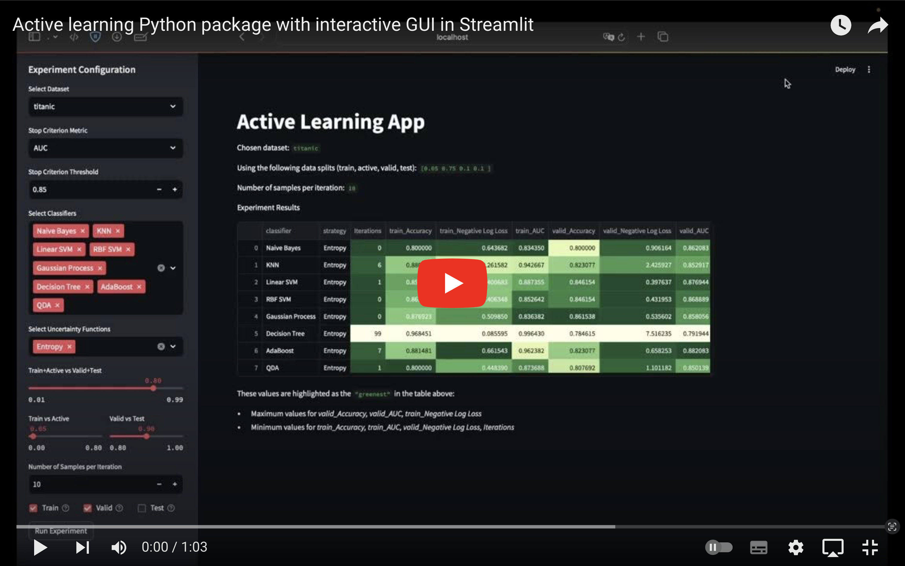

# Active Learning app with interactive GUI


## Demo video
[](https://youtu.be/VhhASUaIqqk "Watch demo video")

## Installation
```bash
conda create --name new_env_for_active_learning python=3.10
conda activate new_env_for_active_learning
pip install pipenv
pipenv install --dev
```

## Running the app
```bash
pipenv shell
streamlit run active_learning_app.py
```
