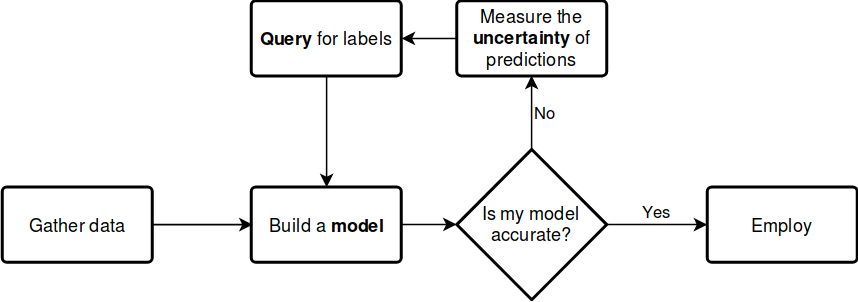
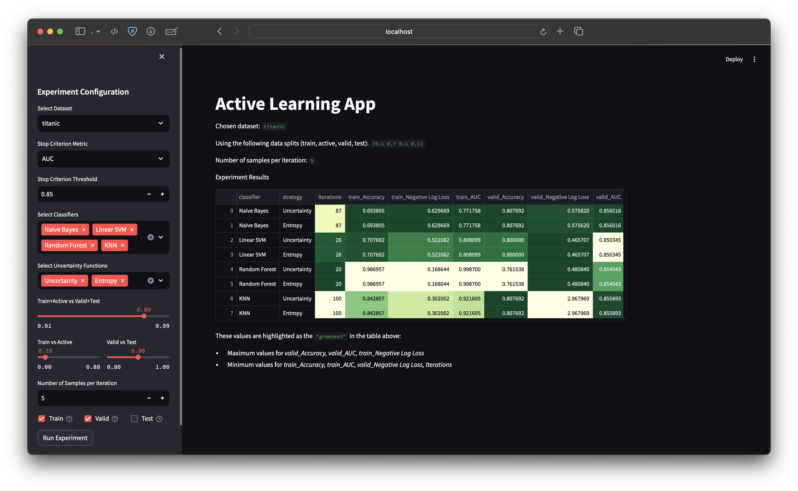
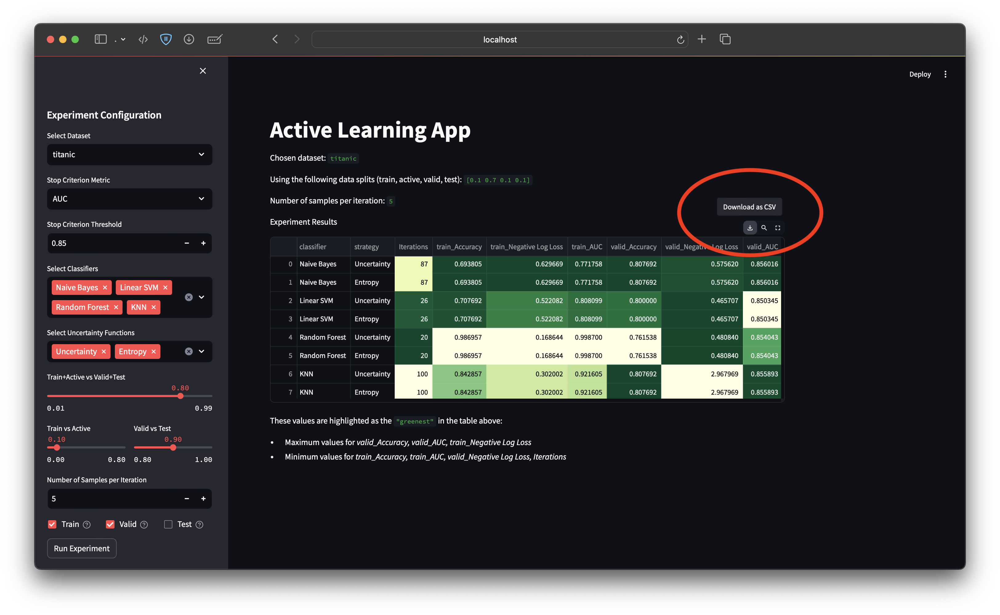
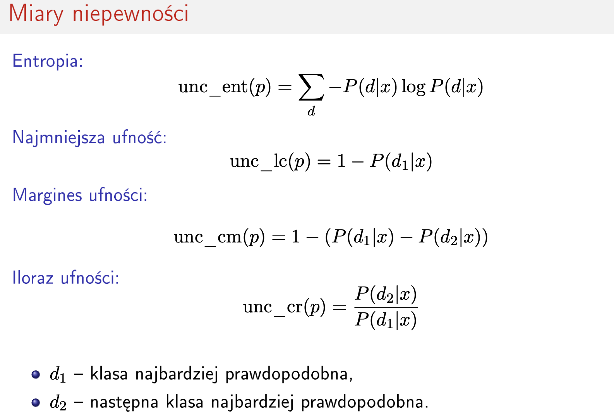

Richard Staszkiewicz
Miłosz Łopatto

# ZUM projekt - dokumentacja końcowa

## Temat projektu
10. Aktywne uczenie się modeli klasyfikacji na podstawie małych zbiorów trenujących przez zgłaszanie zapytania o prawdziwe wartości atrybutu docelowego dla ograniczonej liczby przykładów z dostarczonego dużego zbioru danych nieetykietowanych wybranych według określonych kryteriów (np. przykłady bliskie granicy decyzyjnej dotychczasowego modelu lub takie, dla których jego predykcje są obarczone największą niepewnością) i iteracyjne doskonalenie modelu na podstawie powiększanego w ten sposób zbioru trenującego. Implementacja w formie opakowania umożliwiającego użycie dowolnego algorytmu klasyfikacji dostępnego w środowisku R lub Python stosującego standardowy interfejs wywołania. Badanie wpływu użycia aktywnego uczenia się na jakość modeli klasyfikacji tworzonych na podstawie małych zbiorów trenujących za pomocą wybranych algorytmów dostępnych w środowisku R lub Python.

### Interpretacja tematu
Temat zinterpretowano jako polecenie zbudowania biblioteki w języku Python poddające obiekty o interfejsie klasyfikatora zaczerpniętym ze znanej biblioteki scikit-learn uczeniu aktywnemu na małej ilości otagowanych danych.

#### Pętla aktywnego uczenia

źródło: [1]


## Opis części implementacyjnej
W ramach implementacji zostały zrealizowane osobno moduły do uczenia aktywnego oraz interfejsu użytkownika. W efekcie użytkownik może korzystać z biblioteki jak z dowolnej innej biblioteki, a dodatkowo będzie mógł alternatywnie wykorzystać interfejs użytkownika do łatwiejszego wykonywania eksperymentów.

### Lista dostępnych algorytmów klasyfikacji
Zaimplementowany pakiet umożliwia wykonywanie eksperymentów z różnymi algorytmami klasyfikacji z biblioteki **SciKit Learn**:
- Nearest Neighbors (sklearn.neighbors.KNeighborsClassifier)
- Linear SVM (sklearn.svm.SVC)
- RBF SVM (sklearn.svm.SVC)
- Gaussian Process (sklearn.gaussian_process.GaussianProcessClassifier)
- Decision Tree (sklearn.tree.DecisionTreeClassifier)
- Random Forest (sklearn.ensemble.RandomForestClassifier)
- AdaBoost (sklearn.ensemble.AdaBoostClassifier)
- Naive Bayes (sklearn.naive_bayes.GaussianNB)
- QDA (sklearn.discriminant_analysis.QuadraticDiscriminantAnalysis)
Wszelkie uzbierane dane numeryczne będące rezultatami działania poszczególnych algorytmów można przeanalizować zbiorowo jako DataFrame wygenerowany przy pomocy **Pandas**.

#### Parametry algorytmów
Algorytmy klasyfikujące nie są przedmiotem badania, które skupia się na active learningu i jego parametrze strategii. W związku z powyższym, oprócz tego jednego hiperparametru, reszta pozostanie stała. W większości przypadków zdecydowaliśmy się zostawić domyślne wartości hiperparametrów. Modele są inicjowane w następujący sposób:
```python
classifiers = {
    "KNN": KNeighborsClassifier(3),
    "Linear SVM": SVC(kernel="linear", probability=True),
    "RBF SVM": SVC(kernel="rbf", probability=True),
    "Gaussian Process": GaussianProcessClassifier(),
    "Decision Tree": DecisionTreeClassifier(),
    "Random Forest": RandomForestClassifier(),
    "AdaBoost": AdaBoostClassifier(),
    "Naive Bayes": GaussianNB(),
    "QDA": QuadraticDiscriminantAnalysis(),
}
```

### Funkcjonalność
Zaimplementowany pakiet umożliwia trenowanie algorytmów zgodnie z ideą aktywnego uczenia. Umożliwia do funkcja `active_learn` w pliku `core.py`. Możemy do niej przekazać następujące parametry:

- dane
- kryterium stopu jako funkcję opartą na jednej z metryk jakości, na przykład `lambda x: x["Accuracy"] > 0.9`
- model
- funkcja niepewności
- procentowy podział danych na zbiór treningowy, zbiór do aktywnego uczenia, zbiór walidacyjny oraz zbiór testowy
- liczba próbek dokładanych w jednej iteracji aktywnego uczenia
- stan losowy umożliwiający reprodukcję otrzymanych wyników

Ponadto pakiet umożliwia uruchomienie całego eksperymentu porównawczego będącego na wyższym poziomie abstrakcji. Realizuje to funkcja `experiment` znajdująca się także w pliku `core.py`. Przyjmuje ona następujące parametry:

- lista dostępnych zbiorów danych na których mają zostać przeprowadzone eksperymenty
- kryterium stopu (identycznie jak we wcześniej opisywanej funkcji `active_learn`)
- lista modeli do przetestowania
- lista funkcji niepewności do przetestowania
- procentowy podział danych (identycznie jak we wcześniej opisywanej funkcji `active_learn`)
- lista liczb próbek dokładanych w jednej iteracji aktywnego uczenia
- stan losowy umożliwiający reprodukcję otrzymanych wyników

#### Przykłady użycia

_active\_learn(data: str, stop\_criterion, classifier, uncertainty\_fc, data\_splits: np.array = np.array([0.1, 0.7, 0.1, 0.1]), n\_samples=100, random_state=RANDOM\_STATE):_
```python
train, valid, test, iter = active_learn('titanic', lambda x: x['Accuracy'] > 0.9, GaussianNB(), uncertainty_sampling)
print(f"Iterations: {iter}")
print(train)
print(valid)
print(test)
```

```python
Iterations: 10
{'Accuracy': 0.7770334928229665, 'Negative Log Loss': 0.6655082319831331, 'AUC': 0.8277974683544305}
{'Accuracy': 0.8076923076923077, 'Negative Log Loss': 0.6339302443156313, 'AUC': 0.8473865877712031}
{'Accuracy': 0.7518796992481203, 'Negative Log Loss': 0.7280167235970085, 'AUC': 0.7584905660377359}
```

_experiment(data: list, stop\_criterion, classifiers: dict, uncertainty\_fcs: dict, data\_splits: np.array = np.array([0.1, 0.7, 0.1, 0.1]), n\_samples=[100], random\_state=RANDOM\_STATE)_
```python
from sklearn.neighbors import KNeighborsClassifier
from .sampling import confidence_margin_sampling
from .sampling import confidence_quotient_sampling
from .sampling import entropy_sampling
from .sampling import uncertainty_sampling

df = experiment(
    data=["titanic"],
    stop_criterion=lambda x: x["Accuracy"] > 0.9,
    classifiers={"KNN": KNeighborsClassifier(3)},
    uncertainty_fcs={
        "Uncertainty": uncertainty_sampling,
        "Entropy": entropy_sampling,
        "Confidence margin": confidence_margin_sampling,
        "Confidence quotient": confidence_quotient_sampling,
    },
)
df.to_csv("sth.txt")
```

_sth.txt_
```.csv
,data,classifier,strategy,N sampled per iter,Iterations,train_Accuracy,train_Negative Log Loss,train_AUC,valid_Accuracy,valid_Negative Log Loss,valid_AUC,test_Accuracy,test_Negative Log Loss,test_AUC
0,titanic,KNN,Uncertainty,100,10,0.8535885167464115,0.2955589612276564,0.9368646543330087,0.7846153846153846,2.768178906758788,0.8365384615384616,0.6917293233082706,5.1595323074189485,0.728066037735849
1,titanic,KNN,Entropy,100,10,0.8535885167464115,0.2955589612276564,0.9368646543330087,0.7846153846153846,2.768178906758788,0.8365384615384616,0.6917293233082706,5.1595323074189485,0.728066037735849
2,titanic,KNN,Confidence margin,100,10,0.8535885167464115,0.2955589612276564,0.9368646543330087,0.7846153846153846,2.768178906758788,0.8365384615384616,0.6917293233082706,5.1595323074189485,0.728066037735849
3,titanic,KNN,Confidence quotient,100,10,0.8535885167464115,0.2955589612276564,0.9368646543330087,0.7846153846153846,2.768178906758788,0.8365384615384616,0.6917293233082706,5.1595323074189485,0.728066037735849
```
### Charakterystyka zbiorów danych
Domyślnie pakiet umożliwia przeprowadzanie eksperymentów na poniższych zbiorach danych:

- Zbiór [Titanic](https://www.kaggle.com/datasets/brendan45774/test-file) - będziemy dokonywać na nim klasyfikacji binarnej, dokładniej przewidywania wartości klasy `Survived`.
- Zbiór [MNIST](https://www.openml.org/search?type=data&status=active&id=554) - jest to zbiór obrazków ręcznie pisanych cyfr od 0 do 9. 10 klas, 70000 próbek i 784 cech na każdą próbkę.


### Preprocessing danych
Dla uproszczenia do klasyfikacji wykorzystane zostały jedynie kolumny numeryczne. Pominęliśmy kroki takie jak przykładowo one-hot encoding dla kolumn kategorycznych. Uznaliśmy, że główny temat i cel projektu tego nie wymaga, a takie podejście pozwoliło nam skrócić czas obliczeń.

Dane dzielone są na 4 zbiory: `Train`, `Active`, `Valid` oraz `Test`, gdzie:
- `Train` jest zbiorem danych do początkowego trenowania modeli
- `Active` jest zbiorem danych z którego brane są próbki w kolejnych iteracjach aktywnego uczenia
- `Valid` jest zbiorem walidacyjnym
- `Test` jest zbiorem testowym

### Opis interfejsu graficznego
Interfejs użytkownika podczas aktywnego uczenia został zrealizowany jako aplikacja webowa przy pomocy biblioteki **Streamlit**.



Interfejs graficzny pozwala na wygodne skonfigurowanie poniższych parametrów eksperymentu:

- wybór zbioru danych (na przykładzie wybrany został zbiór `Titanic`)
- wybór kryterium stopu (na przykładzie: `AUC`)
- ustalenie progu kryterium stopu na zbiorze walidacyjnym, po którym moduł przestaje wykonywać kolejne iteracje trenowania (na przykładzie: `0.85`)
- wybór modeli do przetestowania (na przykładzie wybrany został `Naive Bayes`, `Linear SVM`, `Random Forest` oraz `KNN`)
- wybór funkcji niepewności do przetestowania (na przykładzie wybrane strategie `Uncertainty` oraz `Entropy`)
- pierwszy suwak umożliwia zdefiniowanie podziału na dwie części - pierwsza część będzie dalej przeznaczona na zbiór treningowy oraz zbiór do aktywanego uczenia, a druga część będzie dalej przeznaczona na zbiór walidacyjny oraz zbiór treningowy (w tym wypadku 80% danych przeznaczamy na `Train+Active`, a 20% danych przeznaczamy na `Valid+Test`)
- następnie dwa suwaki umożliwiają dostosowanie proporcji zbiorów `Train+Active` oraz `Valid+Test` (w tym wypadku ostatecznie 10% przeznaczamy na zbiór `Train` i 70% na zbiór `Active`, a pozostałe 20% rozdzielamy po równo na zbiory `Valid` oraz `Test`)
- ustawienie `Number of Samples per Iteration` pozwala nam zdefiniować liczbę przykładów dobieranych w kolejnych iteracjach aktywnego uczenia (w tym wypadku `5`)
- ostatnia opcja umożliwia nam wybranie zbiorów danych dla których wyniki mają być widoczne w wynikowej tabeli (w tym wypadku chcemy móc porównać wyniki dla zbiorów `Train` oraz `Valid`, natomiast nie chcemy znać wyników uzyskiwanych przez modele na zbiorze testowym)

Na powyższym przykładzie widzimy, że w tym przypadku obie strategie zadziałały tak samo dla każdego z modeli - osięgnięcie zadanego AUC na zbiorze walidacyjnym zajęło tyle samo iteracji dla każdej ze strategii. Porównanie miar niepewności znajduje się w dalszej części tego raportu.

Dodatkowo wygenerowane wyniki można w prosty sposób pobrać jako plik w formacie `.csv`:


Filmik prezentujący działanie interfejsu graficznego:
[app_demo_video.mp4](docs/assets/app_demo_video.mp4)


## Porównanie miar niepewności

Pakiet umożliwia realizowanie eksperymentów z wykorzystaniem następujących strategii zapytań:


źródło: [2]

#### Entropia (Entropy sampling)
Entropia mierzy niepewność modelu poprzez ocenę rozkładu prawdopodobieństwa przewidywanych klas. Im wyższa entropia, tym większa niepewność modelu co do klasyfikacji danego przykładu. Wybierane są próbki z najwyższą entropią.
- **Zastosowanie**: Dobrze sprawdza się w sytuacjach, gdy chcemy uwzględnić cały rozkład prawdopodobieństwa, a nie tylko najbardziej prawdopodobne klasy.
- **Przykład zastosowania**: W klasyfikacji wieloklasowej, gdzie interesuje nas pełny rozkład prawdopodobieństwa dla każdej klasy, np. w rozpoznawaniu obrazów z wieloma kategoriami.

#### Najmniejsza ufność (Uncertainty sampling)
Strategia najmniejszej ufności wybiera próbki, dla których model ma najmniejszą pewność co do swojej predykcji. Jest to najprostsza forma miary niepewności, gdzie wybierane są próbki z najniższym prawdopodobieństwem przypisanym do przewidywanej klasy.
- **Zastosowanie**: Najlepsza w sytuacjach, gdy interesuje nas tylko najbardziej niepewna predykcja, bez uwzględniania innych klas.
- **Przykład zastosowania**: W klasyfikacji binarnej, gdzie chcemy skupić się na przypadkach, które model klasyfikuje z najmniejszą pewnością, np. w wykrywaniu spamu.

#### Margines ufności (Confidence margin sampling)
Margines ufności mierzy różnicę między prawdopodobieństwami dwóch najbardziej prawdopodobnych klas. Mniejsze różnice wskazują na większą niepewność modelu. Próbki z najmniejszym marginesem są wybierane do dalszego uczenia.
- **Zastosowanie**: Użyteczna, gdy chcemy skupić się na próbkach, gdzie model jest niepewny między dwiema najbardziej prawdopodobnymi klasami. Jest bardziej czuła na przypadki, gdzie model jest niepewny między dwoma bliskimi klasami.
- **Przykład zastosowania**: W klasyfikacji obrazów, gdzie model jest niepewny między dwoma podobnymi kategoriami, np. rozpoznawanie różnych ras psów.

#### Iloraz ufności (Confidence quotient sampling)
Iloraz ufności to stosunek prawdopodobieństwa najbardziej prawdopodobnej klasy do drugiej najbardziej prawdopodobnej klasy. Niższy iloraz wskazuje na większą niepewność. Próbki z najniższym ilorazem są wybierane do dalszego uczenia.
- **Zastosowanie**: Przydatna, gdy chcemy uwzględnić względną pewność modelu między dwiema najbardziej prawdopodobnymi klasami. Jest bardziej czuła na przypadki, gdzie różnice w prawdopodobieństwach są znaczące, ale niekoniecznie bliskie.
- **Przykład zastosowania**: W klasyfikacji medycznej, gdzie różnice w prawdopodobieństwach mogą być znaczące, np. diagnozowanie chorób na podstawie wyników badań.

## Struktura projektu
Projekt składa się z biblioteki backendowej o źródłach w [./src](./src/inter_active_learning/) oraz [interfejsu graficznego](./active_learning_app.py) do przykładowych interakcji z nią. Pozostałe pliki za wyłączeniem raportów o przedrostku "zum\_" są skonfigurowanym szablonem biblioteki na podstawie projektu [cookiecutter](https://github.com/ionelmc/cookiecutter-pylibrary).

### Biblioteka
Biblioteka składa się z trzech modułów: [core](./src/inter_active_learning/core.py), [data](./src/inter_active_learning/data.py) oraz [sampling](./src/inter_active_learning/sampling.py).

#### Core
Moduł core jest modułem głównym, udostępniający abstrakcje do wykonywania eksperymentów oraz prostą funkcję wyliczającą metryki. Abstrakcje obejmują zarówno możliwość przeprowadzenia pojedynczego eksperymentu, zwracającego słowniki dla każdego ze zbiorów (treningowego, validacyjnego oraz testowego) bądź serię eksperymentów w postaci iloczynu kartezjańskiego danej przestrzeni przeszukiwań, zwracającej rezultaty w postaci tablicy pd.DataFrame.

#### Data
Moduł data jest modułem pomocniczym, który udostępnia funkcje pobierające i oczyszczające przykładowe dane przed przetwarzaniem. Zawiera także funkcję pomocniczą wspierającą podział zbiorów na daną liczbę podzbiorów o danych proporcjach.

#### Sampling
Moduł sampling jest modułem pomocniczym, który udostępnia funkcje rangujące dostępne do uczenia aktywnego próbki wg. kryteriów oceny i zwraca zadefiniowaną przez użytkownika ilość indexów najbardziej pomocnych w dalszym treningu.

### Interfejs
Interfejs graficzny oparty o Streamlit uostępnia możliwość wywoływania funkcjonalnści _experiment()_ z Core w przyjazny użytkownikowi sposób. By uruchomić wystarczy zainstalować wszystkie wymagane pakiety i zrealizować `streamlit run active_learning_app.py`.

## Pre-commit, autoformat, linter
W ramach konfiguracji pre-commit zastosowano konwencję formatu narzucaną przez narzędzie black oraz ruff. Ma to na celu zwiększenie czytelności kodu oraz jego konwencji.

## Źródła
- [modAL][1]
- [ZUM][2]
- [Pandas][3]
- [Scikit-learn][4]
- [Streamlit][5]
- [Active learning sampling strategies][6]
- [Active learning overview strategies and uncertainty measures][7]

[1]: https://github.com/modAL-python/modAL
[2]: http://elektron.elka.pw.edu.pl/~pcichosz/zum/slajdy/zum-s11.pdf
[3]: https://pandas.pydata.org/
[4]: https://scikit-learn.org/stable/
[5]: https://streamlit.io/
[6]: https://medium.com/@hardik.dave/active-learning-sampling-strategies-f8d8ac7037c8
[7]: https://towardsdatascience.com/active-learning-overview-strategies-and-uncertainty-measures-521565e0b0b
